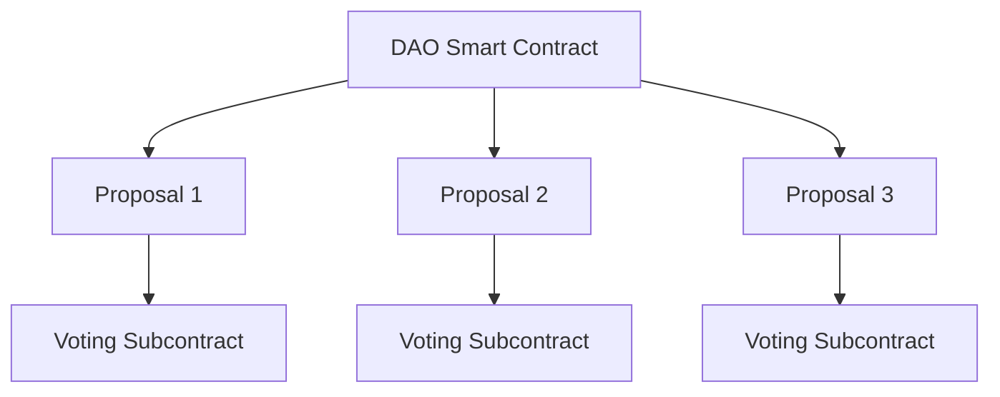
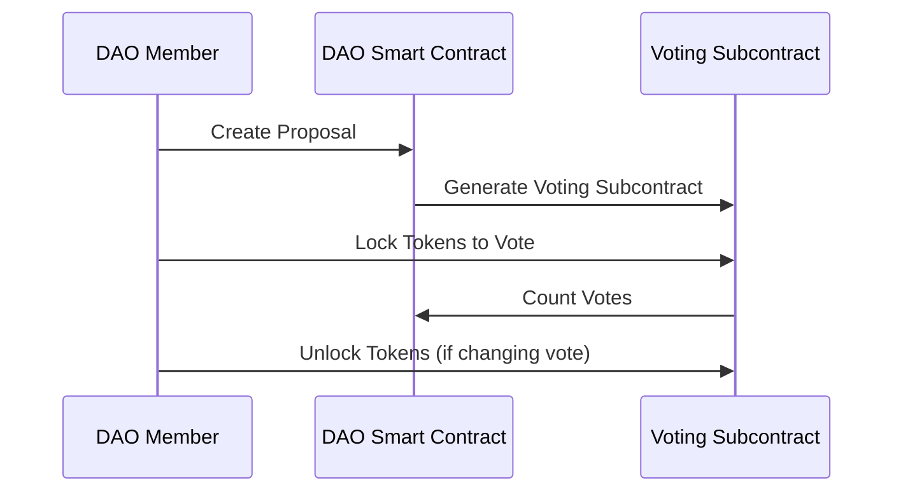

# Alephium DAO Project Documentation

## Introduction

This document provides an overview of a simple Decentralized Autonomous Organization (DAO) implemented on the Alephium blockchain. Alephium enables smart contracts written in the Ralph language and utilizes the UTXO model, which presents unique challenges and opportunities compared to the Ethereum Virtual Machine (EVM) model. This project aims to provide a reusable, open-source DAO framework that leverages Alephium's unique features to ensure secure and transparent governance.

## Key Features

- **Reusable DAO Framework**: Designed to be easily integrated into any smart contract on Alephium.
- **Open Source**: Completely open-source, allowing for community contributions and improvements.
- **UTXO Model Adaptation**: Utilizes Alephium's UTXO model to prevent double voting and ensure vote integrity.
- **Two-Smart Contract System**: Comprises two main smart contracts to manage proposals and voting securely.

## DAO Design

### 1. DAO Smart Contract

The main DAO contract can be inherited by any project wishing to implement a DAO. This contract allows the creation of new proposals and manages the core DAO functionalities.

#### Key Functions

- **Create Proposal**: Allows any DAO member to create a new proposal. This action generates a new subcontract to handle the voting process.
- **Manage Proposals**: Tracks all active proposals and their statuses.

### 2. Voting Smart Contract (Subcontract)

Each proposal creates a subcontract to handle the voting process. This contract ensures that votes are securely locked, preventing double voting and ensuring fair governance.

#### Key Functions

- **Lock Tokens**: Allows DAO token holders to lock their tokens in the subcontract to cast their votes.
- **Unlock Tokens**: Enables users to unlock their tokens, effectively canceling their vote if they wish to change it before the voting period ends.
- **Vote Counting**: Ensures that votes are counted accurately and prevents any double counting or manipulation.

## UTXO Model Adaptation

One of the key challenges in implementing a DAO on Alephium is the UTXO model, which differs from the account model used by EVM. In the UTXO model, tokens are managed as discrete units rather than account balances. This requires a different approach to voting and token management to ensure that votes are not double-counted.

### Key Considerations

- **Token Locking**: Tokens are locked in the voting subcontract, preventing them from being used elsewhere until the vote is unlocked.
- **Vote Integrity**: The locking mechanism ensures that each token can only be used to vote once per proposal, maintaining vote integrity.

## Example Workflow

1. **Create Proposal**: A DAO member creates a new proposal through the DAO smart contract.
2. **Generate Subcontract**: The proposal creation generates a new voting subcontract.
3. **Lock Tokens**: DAO token holders lock their tokens in the subcontract to cast their votes.
4. **Vote Counting**: The subcontract securely counts the votes.
5. **Unlock Tokens**: After the voting period, tokens can be unlocked, allowing them to be reused for future proposals.

## Graphical Representation

Below are graphical representations to help visualize the DAO structure and workflow.

### DAO Structure

### Voting Workflow

## Note

This project provides a foundational DAO framework for the Alephium blockchain, leveraging its UTXO model to ensure secure and transparent governance. By utilizing two smart contracts, the system ensures that votes are accurately counted and that token holders have the flexibility to manage their votes securely. This open-source project invites community participation to enhance and expand its capabilities.

Note that this is a first simple version. The goal is to add complexity in the future. A lot of work can be done with `AssetScript`.

For more details and to contribute, please contact us on contact@black-paper.xyz.